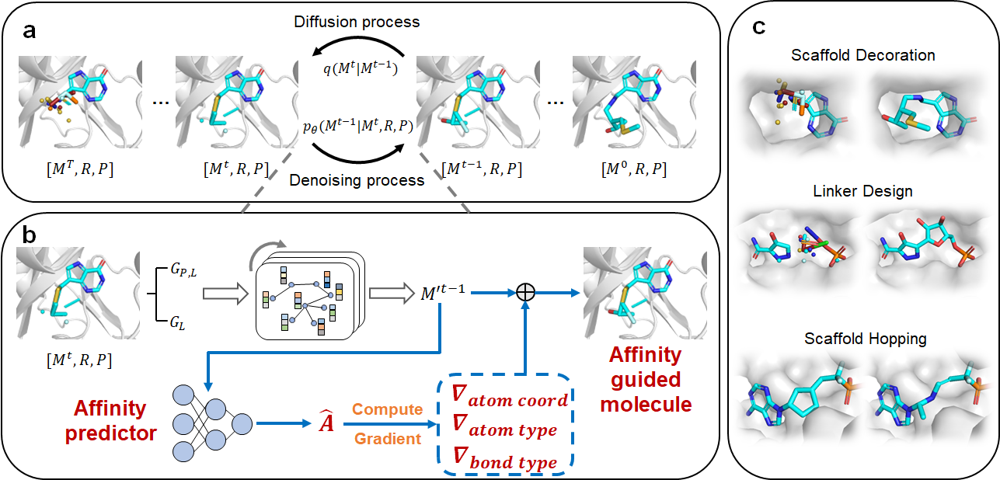

# Diffleop

## Summary
Diffleop is a 3D pocket-aware and affinity guided diffusion model to perform scaffold decoration, fragment-linking and scaffold-hopping for molecular optimization with enhanced binding affinity through a unified framework.

<p align='center'>
 
</p>

## Install conda environment via conda yaml file
```bash
conda env create -f environment.yaml
```

## Datasets
We constructed [`a demo dataset`](./data/demo/) of 500 data points using CrossDocked dataset for scaffold decoration and linker design, respectively.

## Training
To train a model for scaffold decoration task, run:
```bash
python -W ignore scripts/train.py configs/training_dec.yml --device cuda:0 --type dec
```
To train a model for linker design task, run:
```bash
python -W ignore scripts/train.py configs/training_linker.yml --device cuda:0 --type linker
```

## Sampling
You can sample molecules for each input scaffold or fragments and protein pocket and change the corresponding parameters in the config file. You can also download the model checkpoint file from [this link](https://zenodo.org/records/14210941) and save it into `ckpt/`. Run the following:
```bash
python -W ignore scripts/sample.py configs/sampling_dec.yml -i 1 --device cuda:0 --type dec
```
You will get .sdf files of the generated molecules in the directory `outputs/sampling/sdf`. 

## Evaluation
Before calculating the binding affinities between molecules and proteins, you should clone [`TANKBind repository`](https://github.com/luwei0917/TankBind). Place `./scripts/evaluation/cal_affinity.py` into `TankBind/examples`, and you can run evaluation script after sampling molecules:
```bash
python cal_affinity.py --dataset_dir /path/to/dataset_dir --samples_dir ./outputs/sampling/sdf
```